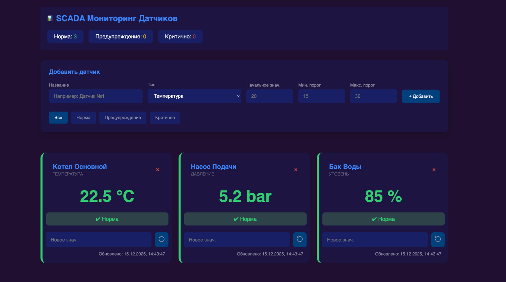

# 📊 Industrial Sensor Dashboard (SCADA)

Современная веб-панель для мониторинга состояния промышленных датчиков. Реализована на **чистом JavaScript (Vanilla JS)** с использованием компонентного подхода и современной модульной архитектуры.

> **Проект выполнен в рамках тестового задания.** Основной фокус — чистая архитектура, отсутствие внешних зависимостей и семантическая верстка.


*(Рекомендуется добавить скриншот интерфейса и назвать его preview.png)*

## 🚀 Функциональность

* **Мониторинг в реальном времени:** Карточки отображают текущие значения температуры, давления и уровня.
* **Умная индикация статусов:**
    * 🟢 **Normal:** Значение в пределах заданного диапазона.
    * 🟠 **Warning:** Незначительное отклонение (буферная зона 20%).
    * 🔴 **Critical:** Критическое отклонение от нормы.
* **CRUD операции:** Добавление новых датчиков через форму и их удаление.
* **Фильтрация:** Мгновенный фильтр по статусам (Все / Норма / Предупреждение / Критично).
* **Статистика:** Автоматический подсчет количества датчиков в каждом статусе.

## 🛠 Технологический стек

Проект создан без использования фреймворков (React/Vue/Angular) для демонстрации глубокого понимания Web API.

* **Core:** JavaScript (ES6+, Classes, Modules).
* **UI:** HTML5, CSS3 (CSS Variables, Grid, Flexbox).
* **Architecture:** MVC-like (разделение на Logic, UI и Data).

## 📂 Структура проекта

Проект организован по принципам Clean Code, разделяя логику и представление:

```text
my-scada/
├── src/
│   ├── core/           # Слой Бизнес-логики (Model)
│   │   ├── Sensor.js         # Класс сущности "Датчик". Содержит логику расчета статусов.
│   │   └── SensorManager.js  # Класс управления состоянием (CRUD операции, фильтрация).
│   │
│   ├── ui/             # Слой Представления (View)
│   │   └── DashboardUI.js    # Отвечает за рендеринг DOM и обновление интерфейса.
│   │
│   ├── types/          # Конфигурация и Типы
│   │   └── sensor.js         # "Single Source of Truth" для констант, цветов и перечислений.
│   │
│   └── styles/         # Стилизация
│       ├── main.css          # Глобальный лейоут, CSS-переменные, сброс стилей.
│       └── sensor-card.css   # Изолированные стили для компонента карточки.
│
├── index.html          # Точка входа (Markup)
└── main.js             # Точка сборки (Controller) - инициализация и связывание модулей.